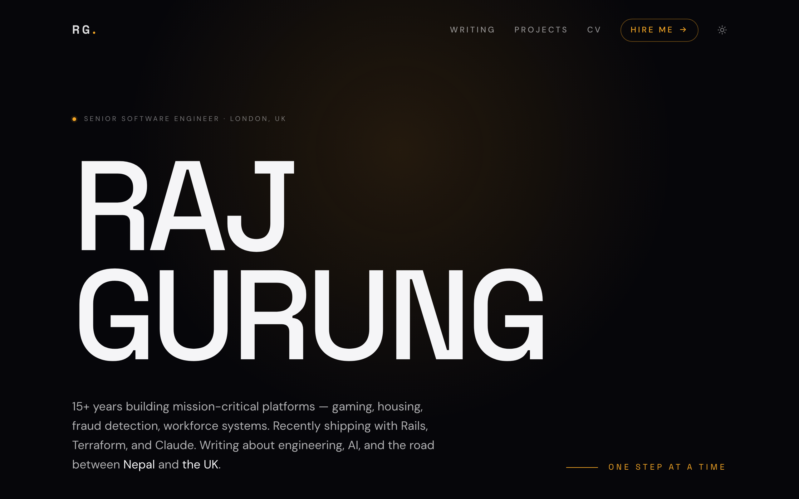

<div align="center">

# ✦ rajgurung.me ✦

### Personal website &middot; writing home &middot; project showcase

[](https://rajgurung.me)
[](https://rajgurung.me/writing)
[](https://rajgurung.me/hire)

<br/>



</div>

---

## 🌗 About

I'm **Raj Gurung**, a senior software engineer in London with 15+ years building mission-critical platforms across gaming, housing, fraud detection, and workforce systems. This site is where I write about engineering, AI, and the road between Nepal and the UK, and where I keep a running showcase of the things I've built.

> **Design:** a dark "Nocturne" aesthetic with a warm amber accent, oversized type, ambient glow, and a film-grain finish. It also ships a pure-white light mode.

## ✨ What's inside

| | Section | What you'll find |
|---|---|---|
| ✍️ | **Writing** | Essays on life, lessons, and software, written in Markdown |
| 🛠️ | **Projects** | A showcase of selected work with live links |
| 🤝 | **Hire** | Experience, skills, and testimonials for people looking to work with me |
| 📄 | **CV** | A readable CV with a downloadable PDF |

## 🧩 Tech

<p>
  
  
  
  
  
  
</p>

## 🚀 Local development

```bash
npm install
npm run dev      # dev server (Vite)
npm run build    # production build to dist/
npm run preview  # preview the production build
```

> Requires **Node.js 20+** (22+ recommended).

## 📚 Docs

| Guide | Description |
|---|---|
| [**Architecture**](docs/architecture.md) | Project structure, routing, and the content system |
| [**Deployment**](docs/deployment.md) | How the site is built and hosted |

<div align="center">
<br/>

`one step at a time` &middot; built between 🇳🇵 and 🇬🇧

</div>
